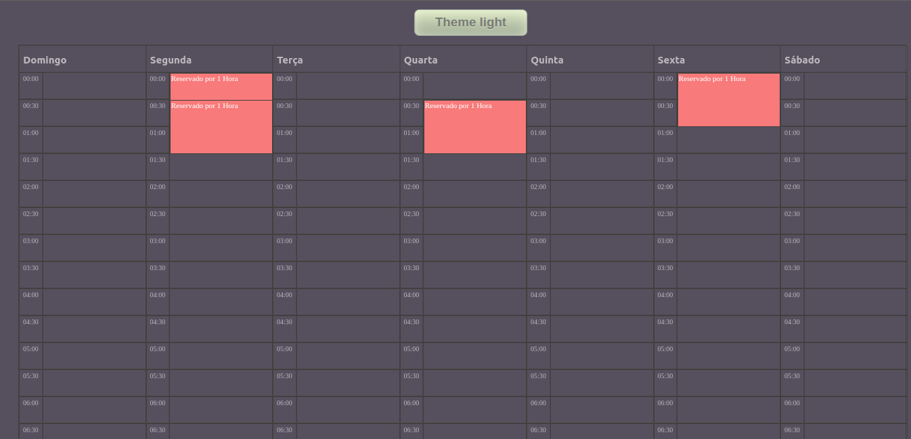

# Agenda Semanal

Este éum projeto de agenda, onde ao clicar na hora ele cria um card de uma hora, podendo apagar o mesmo. O projeto possui dark/light theme.

## Tecnologies

* Typescript
* React.js
* Next
* Jest
* React Testing Library
* Redux
* LocalStorage

## Run Project

```bash
npm run dev
```

## Run Jest Tests

```bash
npm test
```